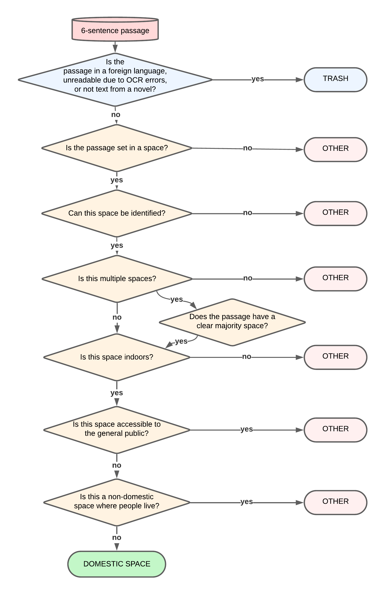

# Making BERT Feel at Home. Modelling Domestic Space in 19th-Century British and Irish Fiction
Repository for the JCLS contribution modelling domestic space in 19th-century British and Irish fiction

Guhr, S., Monaco, J., Sherman, A., Algee-Hewitt, M. & Warner, M., “Making BERT Feel at Home. Modelling Domestic Space in 19th-Century British and Irish Fiction”, Journal of Computational Literary Studies 4(1). https://doi.org/10.48694/jcls.4164.

## Needed data for running the Domestic Space detector 

- Trash_and_Domestic_Space_Detection.ipynb (adaptation of paths needed)
- DataForClassifier contains all the data needed for training, testing and validation
- environment.yml and requirements.txt for setting up a virtual environment

## Needed code for data preparation (usable for own data)
- data_prepartion_chunking.py to chunk plain text into six-sentence chunks

## Decision tree as a visualization of our annotation guidelines:

