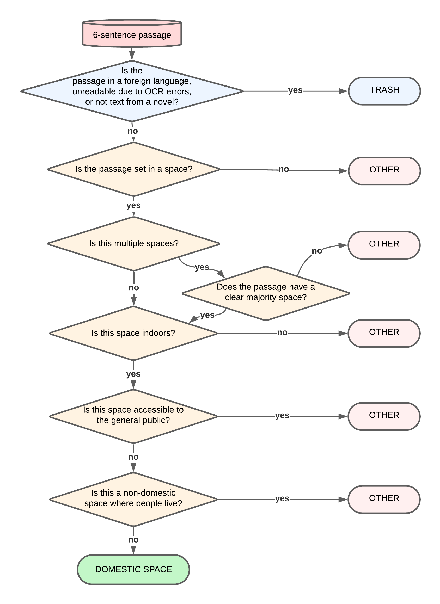

# Making BERT Feel at Home - A submission to the 4th Conference of Computational Literary Studies (under review)

Repository for the JCLS contribution on "Making BERT Feel at Home. Modelling Domestic Space in 19th Century British and Irish Fiction"

## Needed data for running the Domestic Space detector 

- Trash_and_Domestic_Space_Detection.ipynb (adaptation of paths needed)
- DataForClassifier contains all the data needed for training, testing and validation
- environment.yml and requirements.txt for setting up a virtual environment

## Needed code for data preparation (usable for own data)
- data_prepartion_chunking.py to chunk plain text into six-sentence chunks

## Decision tree as a visualization of our annotation guidelines:

